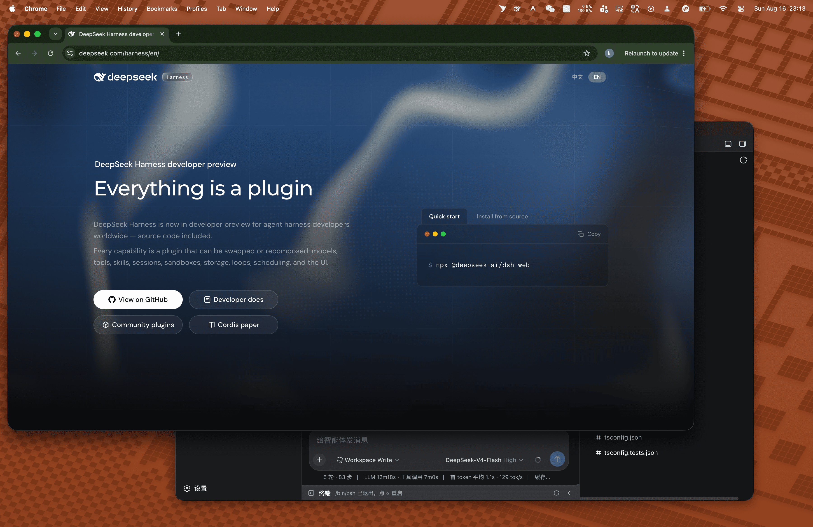
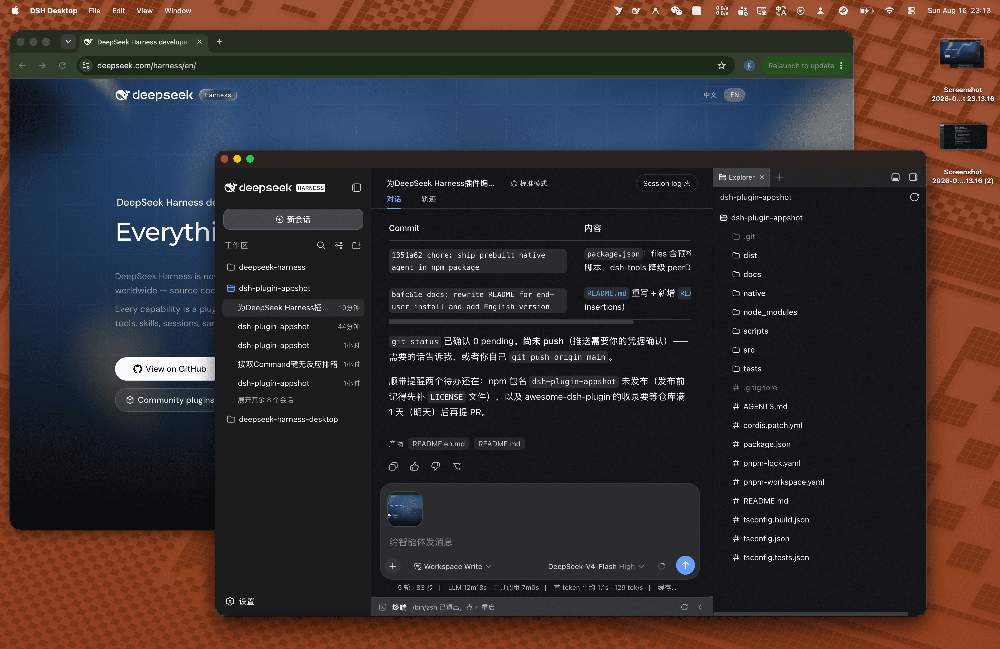
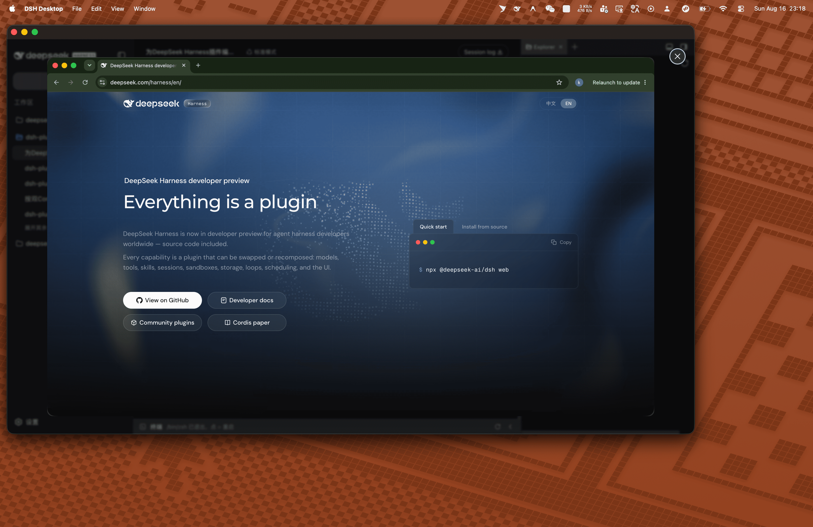

# dsh-plugin-appshot

> A macOS / Windows global-hotkey "one-shot screenshot of the **current window**" that drops the image into the DeepSeek Harness (DSH) composer as context — hand your current working window to the agent with zero friction.

[English](README.en.md) · [中文](README.md) · [Changelog](CHANGELOG.md) · [更新日志](CHANGELOG.zh-CN.md)


## Install (one command)

```sh
dsh plugin --profile web add dsh-plugin-appshot
```

- The npm package ships **prebuilt artifacts** — host plugin + client module + Native Agents for both platforms (the macOS `.app` and a self-contained single-file Windows `.exe`) bundled together; **no local compilation, no build approval** needed.
- **Restart dsh** after installing; you're ready when the startup log shows `[dsh-plugin-appshot] plugin applied successfully` and `native agent ready`.
- On first trigger, macOS will ask for two permissions: **Screen Recording** and **Accessibility** (see [Permissions](#permissions)); Windows needs no extra permission grants.

> Installing from source (developers/contributors): run `pnpm install && pnpm build && pnpm build:native` inside the plugin directory, then run `dsh plugin --profile <name> add ./dsh-plugin-appshot` from its **parent** directory (`dsh plugin add` resolves relative paths against the invoking directory).

## What it is

A DSH take on "[Codex Appshots](https://developers.openai.com/codex/appshots)": brings global-shortcut context capture to DeepSeek Harness.

**Typical scenario**: whenever you run into an issue or question in any app or window — whether inspecting a design, browsing docs, debugging code in your IDE, or troubleshooting terminal output — simply press **Left ⌘ + Right ⌘**. The screenshot of your current window is instantly transferred to the DSH client and attached to the composer draft; just type your question to ask the agent directly, eliminating the friction of manual capturing, app switching, and pasting.

**It captures the "current window", not the "whole screen"** — matching Codex's own Appshots wording (*"An appshot captures the frontmost window only."*):

| ✅ Captures | ❌ Does not capture |
| --- | --- |
| The **one** frontmost window at the moment you trigger (Chrome / VS Code / Finder / Terminal…) | The whole screen, desktop wallpaper, menu bar/Dock, other windows, background apps |

```text
Press Left ⌘ + Right ⌘  →  capture frontmost window  →  image lands in composer  →  describe and Send
```

Currently supports **macOS 14+ (Apple Silicon / arm64)** (Left ⌘ + Right ⌘ by default, remappable in settings) and **Windows 10 19041+ (x64)** (double Ctrl by default, remappable in the settings panel).

## Usage

1. In any app (Chrome, VS Code, Finder / Notepad, Terminal…), press the global hotkey — **Left ⌘ + Right ⌘ together on macOS**, **Left Ctrl + Right Ctrl together on Windows** (remappable in the settings panel) — you capture exactly the **one window** in front of you, not the whole screen.

    **What happens next differs per platform:**

    - **macOS**: after the screenshot lands on disk, the DSH window is activated and focused (capture-then-activate — DSH can never appear in its own screenshot; if DSH is already focused, screenshot is automatically ignored; window activation applies to the DSH desktop app only — under `dsh web` the image still lands in the composer, just without the window activation).
    - **Windows**: **DSH is never activated** — the screenshot silently lands in the current session's input box without interrupting your work; success is signaled by a shutter sound and a fly-in animation (both disableable), and failures surface in a **no-focus-stealing** lightweight toast.

| Before trigger (frontmost app window; screenshots show macOS) | After trigger (captured & mounted into Composer) |
| :---: | :---: |
|  |  |

3. The screenshot is attached to the current session's composer draft (click to inspect in full view, or trigger again to append more).



4. Type a description (e.g. "analyze this error on screen") and hit Send — the screenshot is submitted together with your text.

> The screenshot enters the composer rather than firing the agent directly — you stay in control: add context, append more shots, or remove attachments you don't need.

## Features

**Shared across platforms**

- **Precise single-window capture**: only the **one** window you're looking at — never the whole screen, other windows, or the desktop.
- **Composer draft mounting**: screenshots land in the current session's input draft automatically and are sent with your message; trigger repeatedly to append more.
- **No leftovers**: staging temp files are cleaned in every success/failure branch under a single-owner contract; orphans from crashed runs are swept on plugin startup.

**macOS**

- **Global Dual-Command hotkey**: Left ⌘ + Right ⌘ state machine (the same trigger Codex Appshots uses), with debounce/cooldown; responds even while DSH is in the background or minimized; remappable in settings (e.g. double-tap ⌘).
- **ScreenCaptureKit single-window capture**: transparent layers, shadows and tooltips filtered out, Retina resolution preserved; on multi-display setups only the target window's screen is captured.
- **Capture-then-activate (no self-capture)**: the DSH window is activated and brought to front only after the screenshot has been taken and written to disk — no race condition that could "screenshot DSH itself"; if DSH itself is focused, capture is cleanly ignored.
- **SSE push mounting**: the host persists the screenshot via `saveImage` as a DSH Attachment, pushes it over a self-hosted SSE channel, and the client module mounts it into the active session and focuses the input.
- **Permission feedback**: missing Screen Recording / Accessibility permissions trigger the system authorization prompt, plus a system notification (`UNUserNotificationCenter`) with the failure reason.

**Windows**

- **Double-Ctrl hotkey (remappable)**: Left + Right Ctrl by default; switch to other Ctrl/Alt/Shift combinations in the DSH settings panel, persisted across restarts.
- **Topmost-window-on-cursor's-monitor targeting**: captures the topmost window on the monitor under the cursor; explicitly refuses (with a toast) when the frontmost window is DSH itself, the desktop, the taskbar, or an invisible/spanning window — no accidental captures.
- **Bring-to-front + fallback two-stage capture**: a visible-content backup is taken first, then re-captured after a regular bring-to-front; if activation fails, the backup is used so "what you saw is what you get".
- **Silent delivery (inverse anti-self-capture design)**: DSH is **never activated or focused**; the screenshot travels through an in-memory Node pending buffer and a directed HTTP long poll to the locked client, mounts into the composer, and reports back a `MOUNTED` confirmation.
- **Non-intrusive feedback**: shutter sound, border flash and thumbnail fly-in animation (each disableable); all failure hints are no-activate toasts that never steal focus.

## How it works

Three components, one-way data flow:

```text
┌──────────────────────────┐     NDJSON IPC (stdio)     ┌───────────────────────────┐
│  macOS Native Agent       │ ────────────────────────▶  │  Node / Cordis host plugin │
│  (Appshot Agent.app)      │    type: "appshot"         │  (src/)                    │
│  · Dual-Command FSM       │                            │  · fs.readFile bytes        │
│  · Frontmost-window pick  │                            │  · attachments.saveImage    │
│  · ScreenCaptureKit shot  │                            │  · ownership transfer+unlink│
│  · activate DSH after     │                            │  · webServer SSE broadcast  │
└──────────────────────────┘                            └─────────────┬─────────────┘
                                                                      │ SSE (appshot/ready)
                                                                      ▼
┌──────────────────────────┐
│  DSH Client module (Renderer) │
│  · resolve active sessionId   │
│  · mount ImageAttachmentRef   │
│  · focus composer input       │
└──────────────────────────┘
```

Key design points:

- **No-self-capture hard constraint**: no module may activate/show/focus the DSH window before the screenshot is on disk; window activation is a native capability (`NSRunningApplication`), not a DSH API.
- **Deterministic ownership transfer (Single Owner)**: the staging file belongs to the plugin until `saveImage` succeeds; ownership then moves to the DSH AttachmentStore and the plugin `unlink`s immediately; failure paths clean up in `finally`; orphan files are garbage-collected on startup.

## Permissions

On first trigger, macOS prompts for authorization:

| Permission | Purpose |
| --- | --- |
| **Screen Recording** | ScreenCaptureKit captures the frontmost window |
| **Accessibility** | Global hotkey state machine + window activation/bring-to-front |

If you deny, the capture is aborted with a system notification; re-grant in System Settings → Privacy & Security and retry.

## Limitations

- Supports **macOS 14+ (Apple Silicon / arm64)** and **Windows 10 19041+ (x64)** (self-contained single-file agent — no .NET runtime install needed); WebUI is not supported (a browser sandbox can't access global hotkeys or cross-app activation).
- Window activation applies to the DSH desktop app (macOS) only; under `dsh web` screenshots still land in the composer, but the window is not activated/brought to front; Windows follows the anti-self-capture design and never activates DSH — screenshots silently land in the composer input.
- No region selection, full-screen capture, image annotation, OCR, or screenshot history (all on the roadmap).
- Hotkeys: Left ⌘ + Right ⌘ (Dual Command) by default on macOS; double-Ctrl by default on Windows, remappable in DSH Settings → Screenshot Capture, which also toggles the shutter sound and capture animation (settings persist across restarts).

## Development

```text
src/                 Host plugin (Cordis apply(ctx) entry + windows/macos delivery + client modules)
native/macos/        Swift Native Agent (ScreenCaptureKit + double-Command state machine)
native/windows/      C# Native Agent (Win32 low-level keyboard hook + two-stage GDI capture)
docs/                requirements / technical (per-platform) / tasks / api-grounded-review
tests/               Phase contract tests (node --test)
```

Common commands:

```sh
pnpm build                  # esbuild bundle host plugin + client module → dist/
pnpm typecheck              # tsc --noEmit
pnpm test                   # contract tests (DSH_DISABLE_AGENT_SPAWN=1 to avoid spawning the real agent)
pnpm build:native           # build Appshot Agent.app (macOS)
pnpm build:native:windows   # dotnet publish self-contained single-file exe → native/windows/bin/win-x64/ (Windows)
pnpm test:native            # Windows native unit tests (dotnet test)

# Native diagnostics (inside native/macos)
swift build && .build/debug/appshot-macos --list-windows          # list capturable windows
.build/debug/appshot-macos --cli-capture --output /tmp/test.png    # frontmost-window capture PoC
```

Dependency notes: `@deepseek-ai/cordis` (`^4.0.1`) and `@deepseek-ai/dsh-tools` (exact `0.1.0-rc.6`; npm `latest` is a stale 0.0.1-rc.1 — don't `npm i` over it) are devDependencies used for types only during development; the package metadata deliberately declares **no `peerDependencies`** — on Windows, pnpm creates relative symlinks for peer dependencies, which fails with EPERM for regular users (without Developer Mode). The code uses `import type` only; `ctx` is injected by the host at runtime, so the plugin has zero runtime dependencies.

Publishing (technical-windows.md §7.4): a tag triggers the two-runner GitHub Actions workflow — macOS builds `Appshot Agent.app`, Windows builds `appshot-win-x64.exe`; the assemble job restores both artifacts and runs `npm publish` (`prepack` is platform-aware: it builds the native agent for the current platform, and in CI it enforces a both-artifacts gate that blocks the release if either is missing). A local `pnpm pack` yields a single-platform package and is not a release source.

## License

This project is licensed under the [MIT License](LICENSE).